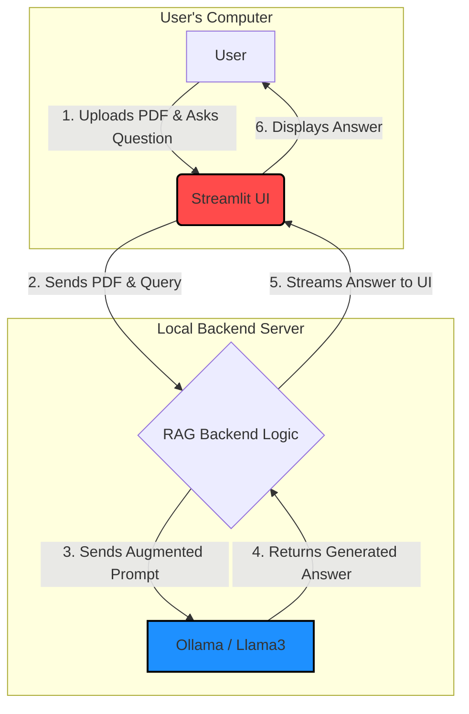

# 🧠 RAG-Based PDF Chatbot with Llama3 and Streamlit

A fully functional Retrieval-Augmented Generation (RAG) chatbot that lets you converse with your PDF documents. Powered by a local Large Language Model (LLM) via Ollama, your data stays private and secure.

## Built with a sleek Streamlit interface, this app makes it easy to upload PDFs, ask questions, and receive intelligent, context-aware answers sourced directly from your documents.

## 📸 Preview
(Insert a screenshot or demo GIF here)

## ✨ Features
1. Interactive Chat Interface
  - Simple and intuitive UI built with Streamlit.

2. PDF Document Processing
  - Upload any PDF and automatically extract, chunk, and process its text content.

3. Private & Local LLM
  - Uses a local LLM (e.g., Llama3.2 via Ollama) — no third-party APIs involved.

4. Retrieval-Augmented Generation (RAG)
  - Finds the most relevant passages from the PDF to answer your questions, reducing hallucinations and improving accuracy.

5. Source Citing
  - Responses include page numbers from the PDF used to generate the answer.
---
## 🛠️ Technical Stack
- Application Framework: Streamlit
- LLM Serving: Ollama with Llama3.2 (or other models as you wish)
- Text Processing: LangChain (for text splitting)
- Document Loading: PyMuPDF (previously Fitz)
- Embedding Model: Sentence-Transformers (all-MiniLM-L6-v2)
- Vector Database: ChromaDB
---

## 👨‍💻 System Architecture

This project implements a full Retrieval-Augmented Generation (RAG) pipeline. The architecture can be understood at two levels: 
    - a high-level overview of the user and system interactions, and 
    - a low-level view detailing the internal workings of the RAG pipeline itself.

### High-Level Architecture:

This diagram shows the main components of the system and the flow of information between them. It provides a bird's-eye view of how a user interacts with the application to get an answer.



#### Explanation of the High-Level Flow:

- User Interaction: The user opens the web application in their browser and interacts with the Streamlit UI to upload a PDF and type a question.
- UI to Backend: The Streamlit frontend sends the uploaded file and the user's query to the backend logic, which is also managed by Streamlit's server process.
- Backend to LLM: The RAG backend processes the query, retrieves relevant context from the PDF, constructs a detailed prompt, and sends it to the Llama3 model running locally via Ollama.
- LLM Response: The LLM generates an answer based only on the context provided in the prompt.
- Streaming to UI: The backend receives the response from the LLM and streams it token-by-token back to the Streamlit UI.
- Display: The user sees the answer appear in the chat window in real-time.

### Low-Level RAG Pipeline:

This diagram provides a detailed look inside the "RAG Backend Logic" block from the high-level view. It shows the two distinct stages of the pipeline: Indexing (processing the PDF) and Retrieval & Generation (answering a question).

```mermaid
graph TD
    subgraph "Stage 1: Indexing Pipeline (One-time per PDF)"
        direction LR
        I1[Uploaded PDF] --> I2{1. Text Extraction<br>(PyMuPDF)}
        I2 --> I3{2. Text Chunking<br>(LangChain)}
        I3 --> I4{3. Embed Chunks<br>(SentenceTransformer)}
        I4 --> I5[(Vector Database<br>ChromaDB)]
    end

    subgraph "Stage 2: Retrieval & Generation Pipeline (Per Query)"
        direction TD
        R1[User Query] --> R2{4. Embed Query<br>(SentenceTransformer)}
        R2 --> R3{5. Similarity Search}
        I5 --> R3
        R3 --> R4{6. Retrieve Top-N<br>Relevant Chunks}
        R4 --> R5{7. Augment Prompt<br>(Context + Query)}
        R1 --> R5
        R5 --> R6[Ollama / Llama3]
        R6 --> R7[Generated Answer]
    end

    style I5 fill:#9AE6B4,stroke:#2F855A,stroke-width:2px
    style R6 fill:#1E90FF,stroke:#000,stroke-width:2px
```

#### Explanation of the Low-Level Flow:

1. Stage 1: Indexing Pipeline (This happens once when a new PDF is uploaded)
- Text Extraction: The text content from the uploaded PDF is extracted using the PyMuPDF library.
- Text Chunking: The extracted text is long, so it's broken down into smaller, manageable, and slightly overlapping chunks using LangChain's RecursiveCharacterTextSplitter. This ensures semantic context is not lost at the boundaries.
- Embedding: Each text chunk is converted into a numerical vector (an "embedding") using the SentenceTransformer model. These embeddings capture the semantic meaning of the text.
- Vector Storage: The embeddings and their corresponding text chunks are stored and indexed in a ChromaDB vector database. This database is optimized for fast similarity searches.

2. Stage 2: Retrieval & Generation Pipeline (This happens every time the user asks a question)
- Embed Query: The user's question is converted into an embedding using the same SentenceTransformer model.
- Similarity Search: This query embedding is used to search the ChromaDB database. The database calculates the similarity (using cosine distance) between the query embedding and all the stored chunk embeddings.
- Retrieve Context: The top 'N' (in this case, 5) most similar chunks from the PDF are retrieved. These are the pieces of text most relevant to the user's question.
- Augment Prompt: A new prompt is constructed. It includes the original user question and the retrieved text chunks as "context". This prompt explicitly instructs the LLM to answer the question based only on the provided context.
- Generate Answer: The final, augmented prompt is sent to Llama3.2, which generates the answer. This answer is then streamed back to the user.

---
## 📁 Project Structure
```
/rag_pdf_chatbot
│
├── app.py              # Main Streamlit application entry point
├── llm_handler.py      # Functions for interacting with the LLM
├── pdf_processor.py    # Functions for processing the uploaded PDF
├── vector_store.py     # Functions for managing the ChromaDB vector store
├── config.py           # Configuration constants (model names, URLs, etc.)
├── requirements.txt    # Project dependencies
└── history.txt         # Stores the latest conversation history
```
---
## 🚀 Setup and Installation
1. Prerequisites:
- Python 3.8+
- Ollama installed and running with at least one model (I used Llama3.2 [https://ollama.com/library/llama3.2])

2. Install the LLM
- Pull the Llama3 model using:
    - (You can use a different model, but update the MODEL variable in config.py accordingly.)

3. Clone the Repository

4. Set Up a Virtual Environment & Install Dependencies

5. Run the Application. (Ensure Ollama is running in the background, then launch the app)

The application will open in your default web browser.
---
## 💬 How to Use
- Launch the application: run `streamlit run app.py` to run the app
- Use the sidebar to upload a PDF file. (Must upload a PDF to start the chat)
- Wait for the document to be processed. (App will take some time to process, please wait a little bit. Also PDF processing time depends of the size of the pdf.) `This app does not support images, it only supports simple text. You can modify pdf_processor.py file to make detailed extraction from pdf`.
- Type your question in the chat input box and press Enter.
- Receive a response with cited page numbers from your document. (If it can't find a suitable context from the PDF, it will try it's best to response according to the query. `The response depends on the LLM model used`)
